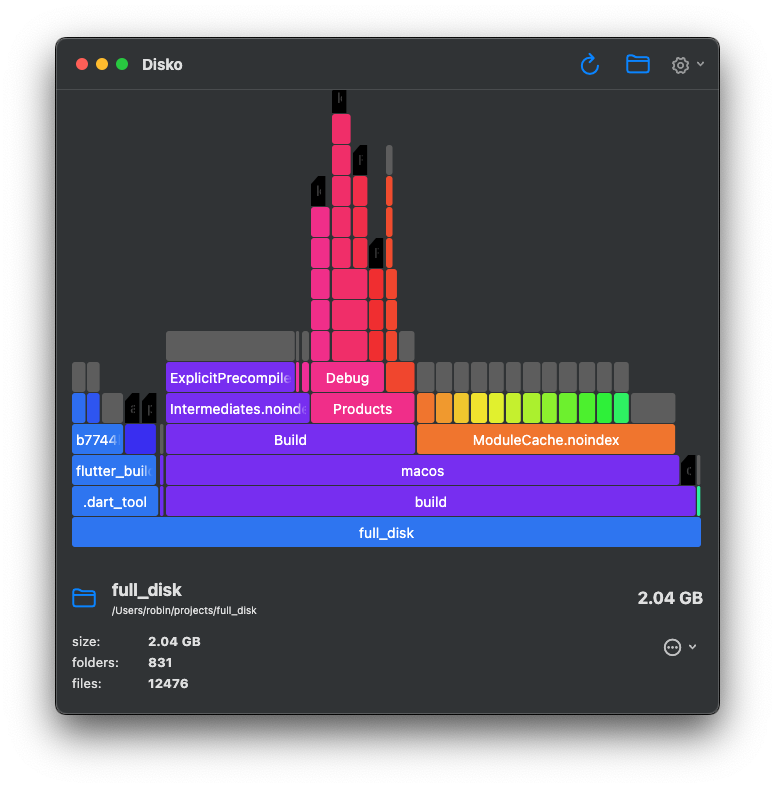

# Disko __

Disko is a minimalist **MacOS** application that allows you to see how much disk space individual folders and files are taking up. It is broadly inspired by the _Disk Usage Analyzer_ application on GNU/Linux.

You can learn more about it on my personal website [here](https://apps.robbb.in/disko).

### Screenshots

__

### Install

1. download the `Disko.app` file from the Releases sidebar
2. put it into your `Applications` directory

### contribute

- you can build the application yourself using [Flutter](https://flutter.dev)
- feel free to reach out if you find issues or have suggestions

Have a great day, 
Yours, Robin

