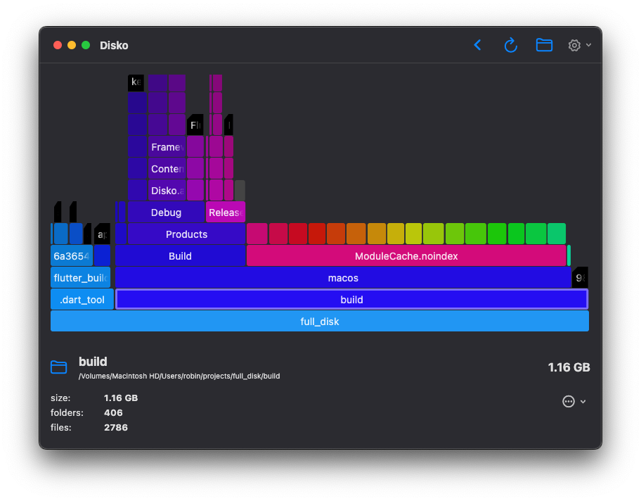

# Disko

Disko is a small minimalist **MacOS** application that allows you to see how much disk space individual application are using. It is broadly inspired by the *Disk Usage Analyzer* application on GNU/Linux.

## Install

You can install the `.app` file from the `/release` directory

Have a great day,
Yours, Robin

